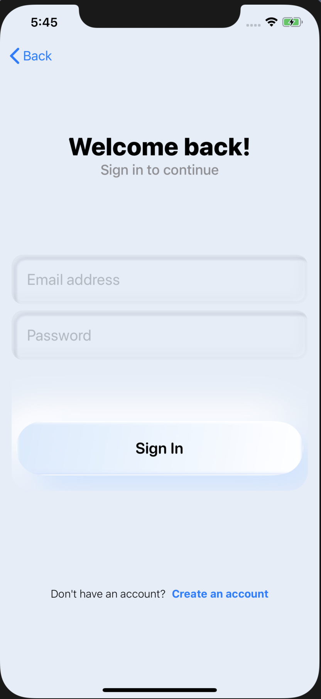

## Welcome to BowfolioApp

# TABLE OF CONTENTS
***
* [OVERVIEW](#overview)
* [PROGRESS + DEVELOPMENT](#progress--development)
* [USER GUIDE](#user-guide)
* [DEVELOPER GUIDE](#developer-guide)
* [COMMUNITY FEEDBACK](#community-feedback)

 

# OVERVIEW
***
The native mobile app that reimplements the functionality of the BowFolios (https://bowfolios.github.io/) application. Users can modify profiles, projects, and interests and they can also browse other's profile and project to see if they have the same interests with users. This App is build with Swift and firebase. It is for IOS platform only.

# PROGRESS + DEVELOPMENT
***

Track the team's progress via Milestones:
* <a href="https://github.com/trigeeks/bowfoliosApp/projects/1">M1</a>

 

# USER GUIDE
***
This section provides a brief walkthrough of the Bowfilios App user interface and its functionality.

### Sign In View
sign in with your email, if you do not have an account, you can press Create an account down below.

