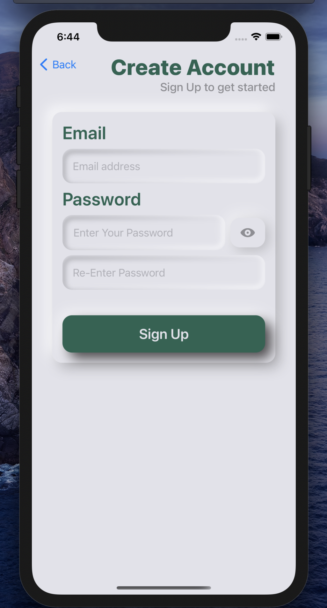
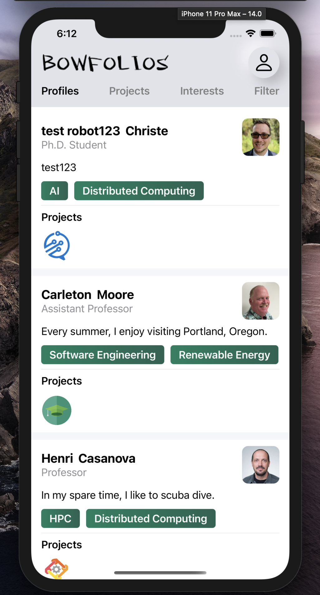
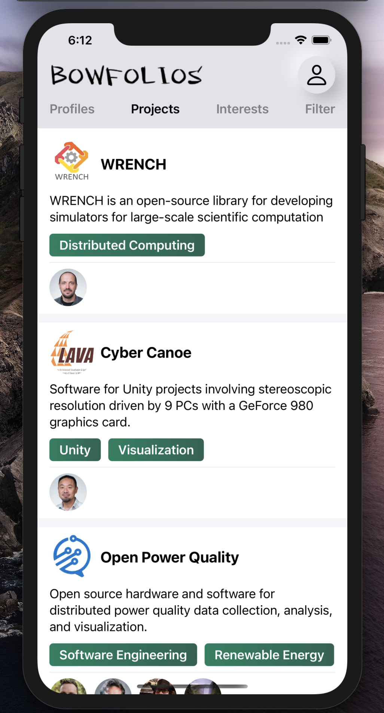

## Welcome to BowfolioApp

# TABLE OF CONTENTS
***
* [OVERVIEW](#overview)
* [PROGRESS + DEVELOPMENT](#progress--development)
* [USER GUIDE](#user-guide)
* [DEVELOPER GUIDE](#developer-guide)

 

# OVERVIEW
***
The native mobile app that reimplements the functionality of the <a href="https://bowfolios.github.io/">BowFolios</a> application. Users can modify profiles, projects, and interests and they can also browse other's profile and project to see if they have the same interests with users. This App is build with Swift and firebase. It is for IOS platform only.

# PROGRESS + DEVELOPMENT
***

Track the team's progress via Milestones:
* <a href="https://github.com/trigeeks/bowfoliosApp/projects/1">M1</a>

 

# USER GUIDE
***
This section provides a brief walkthrough of the Bowfilios App user interface and its functionality.

## Sign In View
sign in with your email, if you do not have an account, you can press Create an account down below.

## Sign Up View
If you do not have an account, you can click sign up to register. After sign up, you will be directly send to our home view.

## Home View
There are four views inside Home View, users can slide left or right to switch view. The user button on the top right can trigger a sub-menu which will lead to Edit Profile View and Add Project View.

### Profiles View
Users can see other people's profile which shows name, title, bio, interests and projects they participate in.

### Projects View
Users can see all the exist projects, which show name, description, interests and participants.

### Interests View
Users can see all the interests with users and projects under that interest.

### Filter View
Users can user filter to choose interests to show and see who has that interest. Users can tap that Plus button to open the selection, once user select any interest, the profiles of users under that interest will be show immediately.

### Edit Profile View
User can edit their own profile by tap the button on the top right, then tap My profile. Users can change their picture, name, bio, interests and projects.

### Add Project View
User can add a new project to the database and they must input enough information to create a new project.

# DEVELOPER GUIDE

First, install the latest version of XCode.

Second, clone the <a href="https://github.com/trigeeks/bowfoliosApp">repo</a> to your local computer. You can run the app by using either the XCode Simulator or an iPhone with the latest version. (Caution: Using the camera function on a simulator will cause a crash.)

